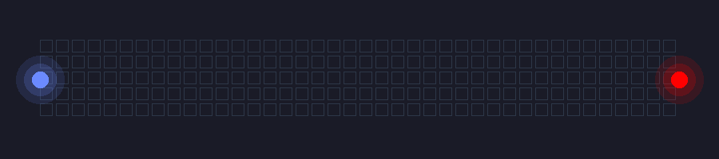

<div align="center">

# AKHILESH


[](https://github.com/Ashthespycodes)
[](https://github.com/Ashthespycodes)

</div>

---

## 👨‍💻 About Me

Computer Science & Engineering student at Manipal University Jaipur with a passion for building scalable applications and solving complex problems. Former Software Developer Intern at Tech Mahindra with hands-on experience in full-stack development.

```cpp
class Developer {
    public:
        string name = "Akhilesh";
        string role = "Software Developer";
        vector<string> interests = {
            "Data Structures & Algos",
            "AIML",
            "Agentic Workflows"
        };
};
```

---

## 🛠️ Technical Skills

<div align="center">

### Languages & Frameworks


<br/><br/>


</div>

---

## 🎓 Experience & Achievements

- **Software Developer Intern** @ Tech Mahindra
- **Dean's List** @ Manipal University Jaipur
- **Deloitte Capstone Project** Contributor
- **Competitive Programming** Enthusiast
- **FIDE Rated** Chess Player

---

## 🔵🔴 Featured Projects

<div align="center">

### **Hollow Purple: The Perfect Merge**



*When Backend (Blue) meets Frontend (Red), magic happens*

</div>

---

## 📫 Connect With Me

<div align="center">

[](https://yourportfolio.com)
[](https://linkedin.com/in/yourprofile)
[](mailto:your.email@example.com)

</div>

---

<div align="center">

*"Building solutions, one commit at a time"* ⚡

</div>
